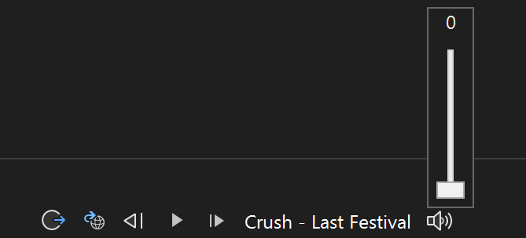

# VS-Spotify

VS-Spotify is a Visual Studio 2022 extension that controls Spotify playback and is hosted in the VS status bar.

This extension requires Spotify Premium.

_Disclaimer_: This project is a hackathon or experimental project with no support or quality guarantee.

## How it works

This extension uses the Spotify Web API to control playback. Upon installing the extension, the user will need to authenticate their Spotify account for the playback controls to appear.

## Features

The extension includes the following controls:

- Play/Pause
- Previous/Skip
- The currently playing song title is displayed in the status bar
- Volume Control



## Local Development (Authentication)

To authenticate against the Spotify APIs you need to create an app in the Spotify developer dashboard. Follow the steps below:

- Login to the [Spotify Dev Dashboard](https://developer.spotify.com/dashboard/applications).
- Create a new app.
- Click "Edit Settings" and add `http://127.0.0.1/` as a redirect URL and save settings.
  - If you want to allow other Spotify users to access the APIs with this app, click "Users and Access" and add the email linked to their Spotify account.
- Copy the "Client ID" that appears under your app name (you'll need this for local testing).
- Open `SpotifyAuthManager.cs` and paste your client id in the const client id field. It should look something like this:

  ```csharp
    internal class SpotifyAuthManager : IDisposable
    {
        private const string PKCE_ACCESS_TOKEN_KEY = "PKCE_ACCESS_TOKEN";
        private const string PKCE_REFRESH_TOKEN_KEY = "PKCE_REFRESH_TOKEN";
        private const string PKCE_EXPIRY_KEY = "PKCE_EXPIRY";
        private const string CLIENT_ID = "CLIENT_ID_HERE"; // <- Right here!

        // ... Rest of class ... //
    }
  ```

> **Disclaimer:**  
> Note that while client ids aren't traditionally considered secret, you should avoid exposing this if you can. While in dev mode, Spotify apps are restricted to only the users whose emails are included in the access settings on the app. However, if put into production mode this will be accessible to anyone. Usually when an oAuth flow is used on a website then the redirect URLs restrict API access to only the specified domain (which is usually owned by the app creators). However, since this extension uses a localhost redirect url, this layer of security is lost.
